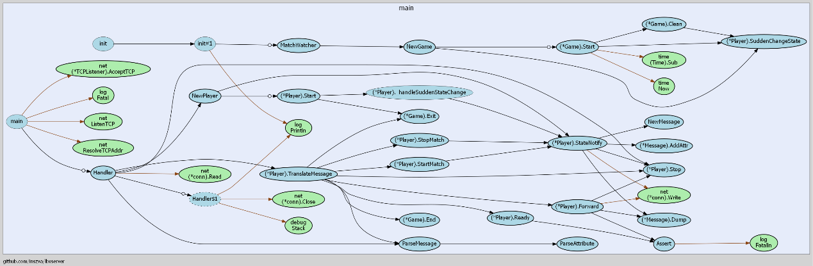
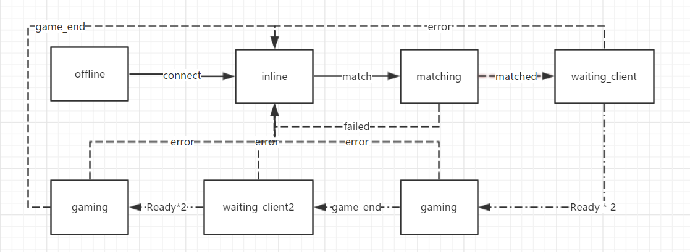

服务器结构

 
服务器采用了Go语言，使用多线程处理请求和计算，对每个游戏、玩家都采用了单独的线程处理，每个线程的变量仅有自己可以修改，其他线程如需修改，需要用channel向该线程发送一个信息来保证线程安全。
玩家的状态机如下：

 
玩家通过连接服务器上线，然后匹配来匹配对手，匹配到后会收到服务器的匹配成功信息，然后需要准备。当双方玩家都准备完成之后，便进入游戏状态。当客户端计算第一轮游戏结束后，发送结束游戏，然后继续等待双方玩家准备，准备完成后，继续下一轮游戏。当第二轮游戏结束后分出胜负，回到在线状态。

